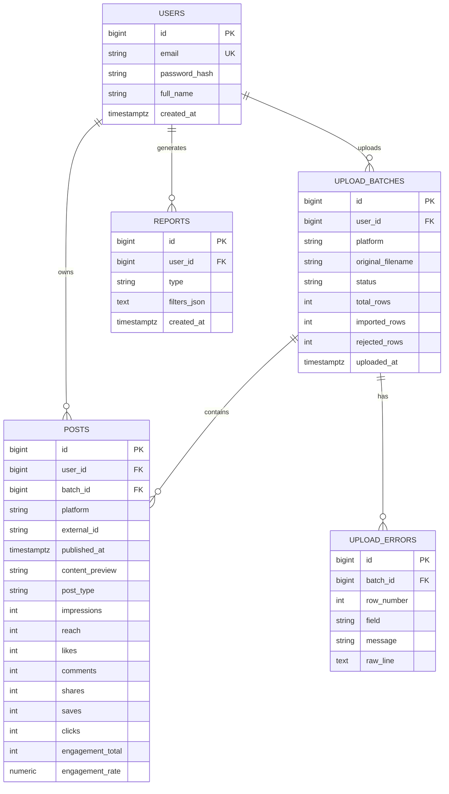

# SocialPulse ER Diyagramı

```mermaid
erDiagram
    USERS ||--o{ UPLOAD_BATCHES : uploads
    USERS ||--o{ POSTS : owns
    USERS ||--o{ REPORTS : generates
    UPLOAD_BATCHES ||--o{ POSTS : contains
    UPLOAD_BATCHES ||--o{ UPLOAD_ERRORS : has

    USERS {
        bigint id PK
        string email UK
        string password_hash
        string full_name
        timestamptz created_at
    }
    UPLOAD_BATCHES {
        bigint id PK
        bigint user_id FK
        string platform
        string original_filename
        string status
        int total_rows
        int imported_rows
        int rejected_rows
        timestamptz uploaded_at
    }
    UPLOAD_ERRORS {
        bigint id PK
        bigint batch_id FK
        int row_number
        string field
        string message
        text raw_line
    }
    POSTS {
        bigint id PK
        bigint user_id FK
        bigint batch_id FK
        string platform
        string external_id
        timestamptz published_at
        string content_preview
        string post_type
        int impressions
        int reach
        int likes
        int comments
        int shares
        int saves
        int clicks
        int engagement_total
        numeric engagement_rate
    }
    REPORTS {
        bigint id PK
        bigint user_id FK
        string type
        text filters_json
        timestamptz created_at
    }
```
